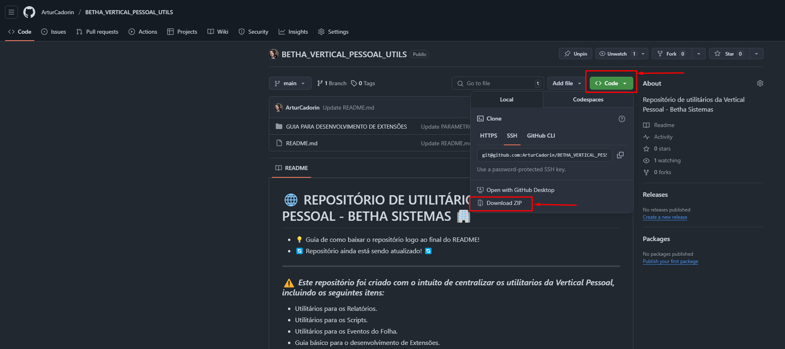
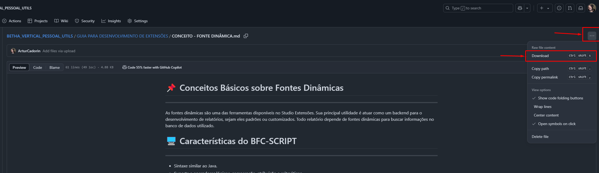

# 🌐 REPOSITÓRIO DE UTILITÁRIOS 👥 VERTICAL PESSOAL - BETHA SISTEMAS 🏢
---
### ⚠️ *Este repositório foi criado com o intuíto de centralizar os utilitarios da Vertical Pessoal*
- 💡 Guia de como baixar o repositório logo ao final do README!
- 🔄 Repositório ainda está sendo atualizado! 🔄
### *Itens:*
- Utilitários para os Relatórios.
- Utilitários para os Scripts.
- Utilitários para os Eventos do Folha.
- Guia básico para o desenvolvimento de Extensões.

# 🗂️ ESTRUTURA DO REPOSITÓRIO:
---
### 🧮 EVENTOS - FOLHA:
- Configuração dos eventos.
- Incidências dos eventos.
- Fórmula dos eventos.

### 💡 GUIA PARA DESENVOLVIMENTO DE EXTENSÕES:
- Guia básico referente a estrutura de relatórios.
- Guia básico referente ao funcionamento dos parâmetros.
- Guia básico referente a consulta em fontes dinâmicas (critério, campos e parâmetros).
- Exemplos de parâmetros.
- Exemplos de fontes dinâmicas.
- Funções e métodos uteis.

### 📊 RELATÓRIOS - FOLHA/RH/PONTO:
- Modelos de fonte dinâmicas.
- Modelos de arquivos Jasper.

### </> SCRIPTS - FOLHA/RH:
- Modelos de scripts.
- Funções e métodos para Service Layer.
- Scripts de **Consulta**.
- Scripts de **Alterações**.
- Scripts de **Importações**.

# 💡 COMO REALIZAR O DOWNLOAD DO REPOSITÓRIO:
---
### 🧑‍💻 Realizar o download de todo o repositório:
#### ⬇️ Com a página do repositório aberta, clicar no botão <> Code >> Download ZIP

### 🧑‍💻 Realizar o download de arquivos individualmente:
#### ⬇️ Com o arquivo desejado aberto, clicar no icone superior direito ... >> Download (Ctrl + Shift + S)

