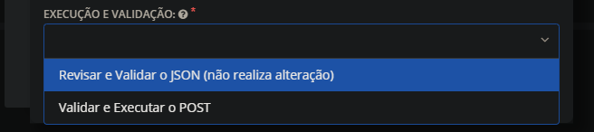
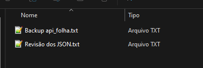
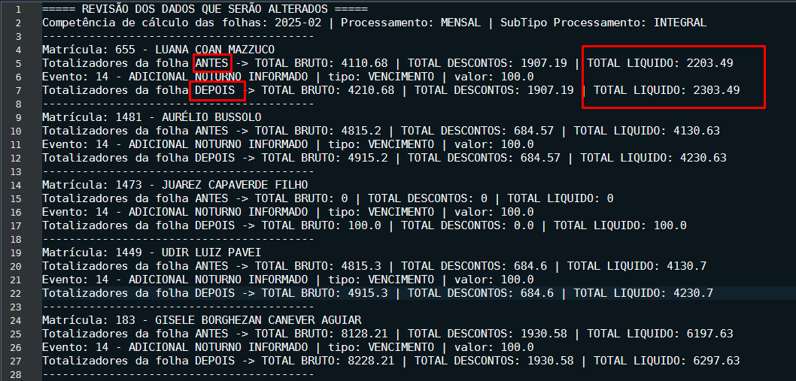
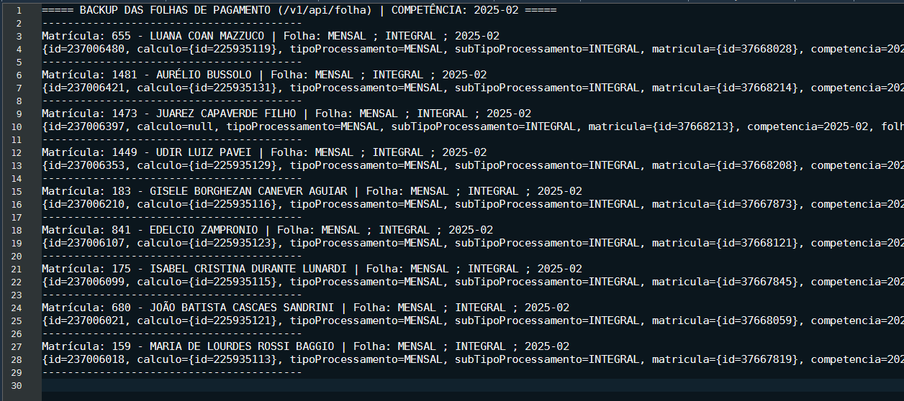
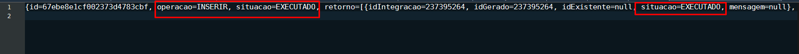
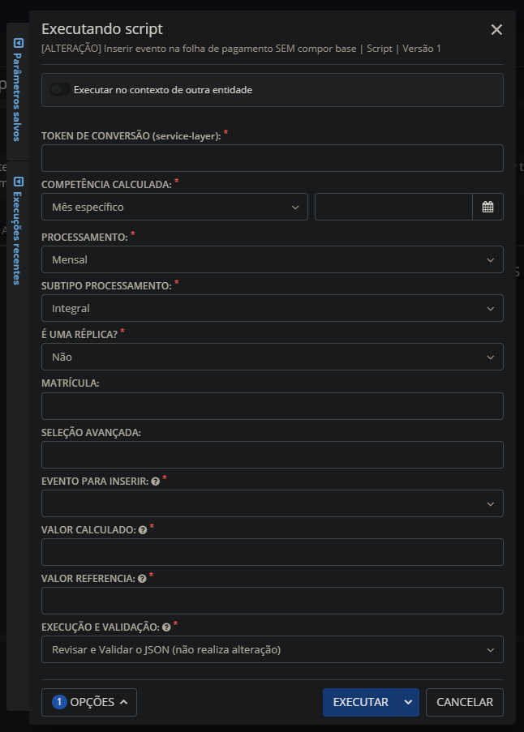

# 📌 Documentação do script: [ALTERAÇÃO] Insere evento na folha de pagamento SEM compor base
---
Este script insere um evento em uma folha de pagamento já calculada/fechada.
⚠️ Para que a alteração seja realizada com sucesso a competência do eSocial deve estar aberta!

# 💡 Sugestão para execução do script
---

### 1º Revisar e Validar o JSON (não realiza alteração)
- Ao escolher está opção o script NÃO irá realizar a alteração, apenas emitir os arquivos para revisão dos dados a serem ajustado.
- Arquivos que serão gerados:
  - 
  - Arquivo de Revisão: Retorna um arquivo TXT com os dados de cada folha para serem revisados antes da alteração.
  - Legenda do arquivo: Informações da matrícula, Evento a ser inserido e Totalizadores da folha ANTES e DEPOIS da alteração.
  - 
  - Arquivo de Backup: Retorna um arquivo TXT com o backup das folhas (via GET antes da alteração).
  - Legenda do arquivo: Informações da folha e JSON da folha antes da alteração. 
  - 
  
### 2º Validar e Executar o POST
- Ao escolher está opção o script irá realizar a alteração e emitir os arquivos gerados pelo script.
- Realizar uma alteração POST diretamente na folha da matrícula informada.
- Retorna os arquivos mencionados antes, ALÉM de retornar também um arquivo com a impressão do lote:
  - 

# 📑 Guia preenchimento dos parâmetros
---

### TOKEN DE CONVERSÃO (service-layer):
- Inserir o token para realização do service layer.
### COMPETÊNCIA CALCULADA:
- Competência na qual a folha está calculada.
### PROCESSAMENTO:
- Tipo de processamento da folha (Mensal, Férias, Rescisão e 13º Salário).
### SUBTIPO PROCESSAMENTO:
- Subtipo de processamento da folha (Adiantamento, Integral e Complementar).
### É UMA RÉPLICA?
- O evento a ser inserido é uma réplica? Caso SIM irá inserir o evento como uma réplica.
### MATRÍCULA:
- Matrícula que irá ter a folha ajustada.
### SELEÇÃO AVANÇADA:
- Seleção avançada de matrículas que terão suas folhas ajustada.
### EVENTO PARA INSERIR:
- Evento que será inserido na folha.
### VALOR CALCULADO:
- Valor calculado do evento a ser inserido na folha.
### VALOR REFERENCIA:
- Valor referência do evento a ser inserido na folha.
### EXECUÇÃO E VALIDAÇÃO:
- Revisar e Validar o JSON:
  - Retorna um arquivo TXT para validação da folha a ser ajustada.
  - Validação dos dados como: Total Líquido, Total Bruto e Total Desconto.
- Validar e Executar o POST:
  - Retorna três arquivos TXT, sendo: Arquivo de validação, arquivo de backup e arquivo com a impressão do lote do SL.
  - Realiza o POST de 50 em 50 folhas. 
